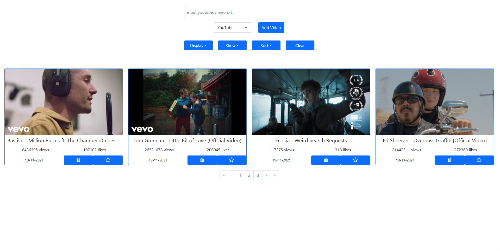
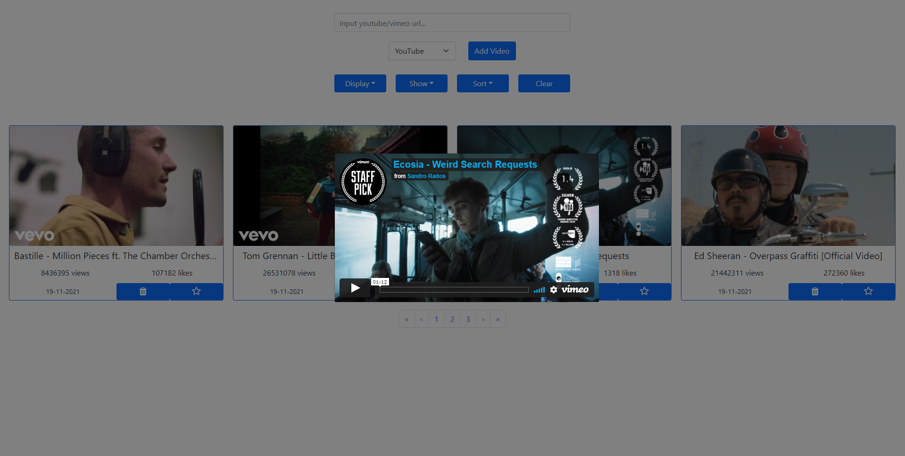
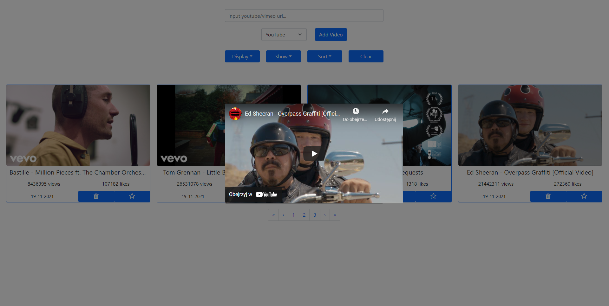
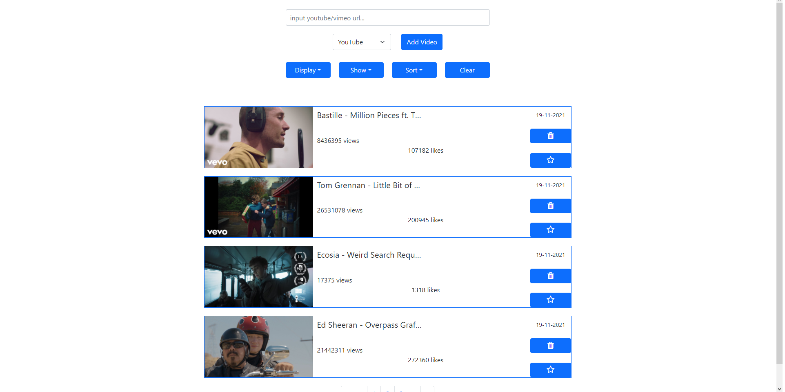
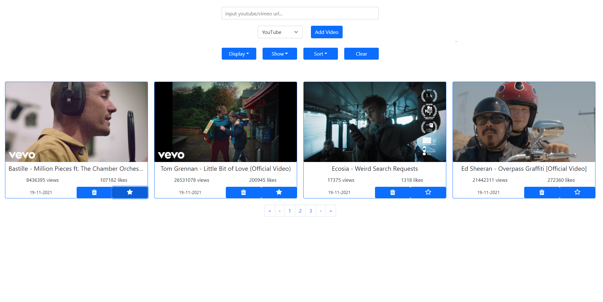

# video-app

**Description:** 
Simple video app where user can save favourite films from YouTube and Vimeo. App display video with data provided by API (views, likes, film name and thumbnail).
User can watch video in modal box. Also user can delete or add video to favourite list. App can display video sorted by date of adding, clear all videos or show video in list/tile mode. Data are stored in local storage.

**Why:** 
This project was created to practice React, java script functions, CSS formatting and HTML tags.

**Skills used:**
- React (Hooks)
- HTML5
- Reactstrap
- YouTube API / Vimeo API
- CSS3
- JS

**Link:**

To proper work app requires access tokes from Vimeo and Youtube Api which are for safety reason not for public.

